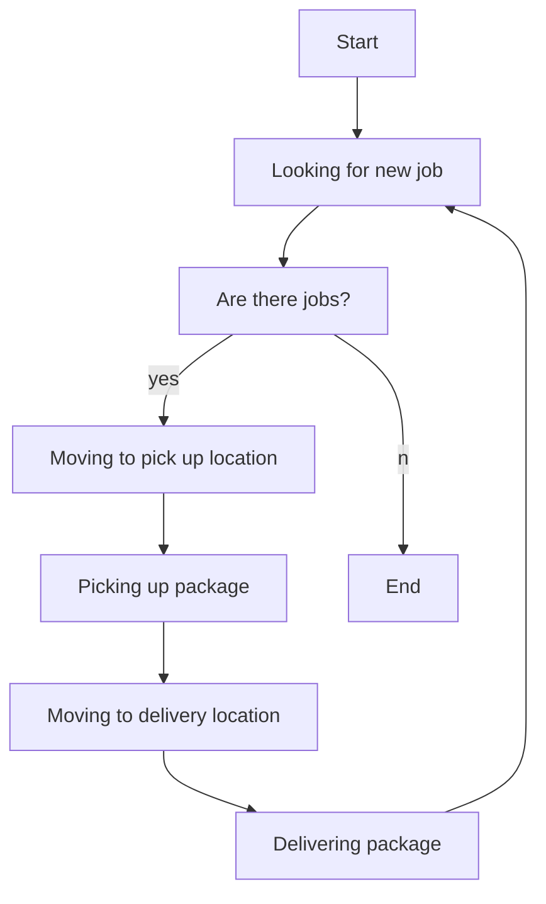

# PuzzleSorter

Question: With software, can we sort jigsaw puzzle pieces and/or Lego? 

Some early prototypes:

- Unity3d: 
- WinForms: 

# How it works
Based on the number of robots (agents that complete work), a timeline is created with the number of turns required. 
- Each turn enables each robot to run one action, either a move from adjacent tile to another tile, pickup a piece, or a dropoff a piece.

There are jobs:

